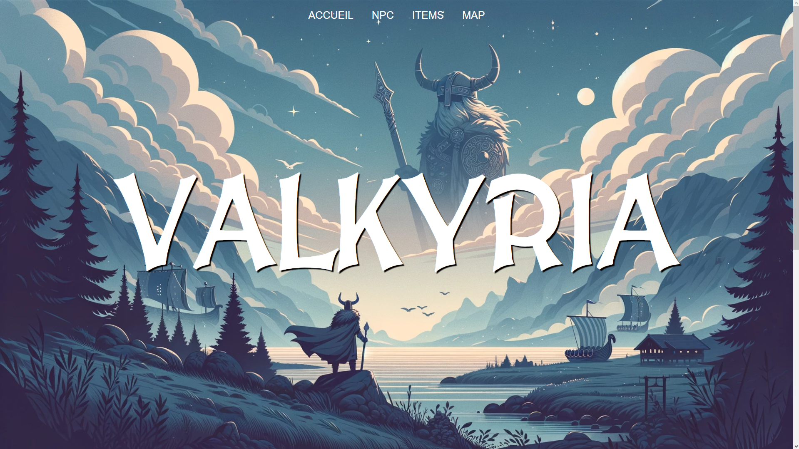
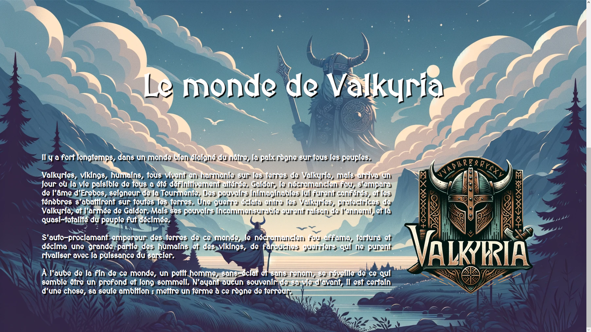
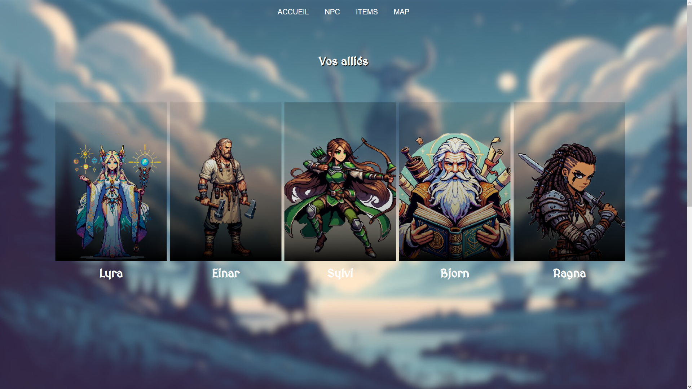
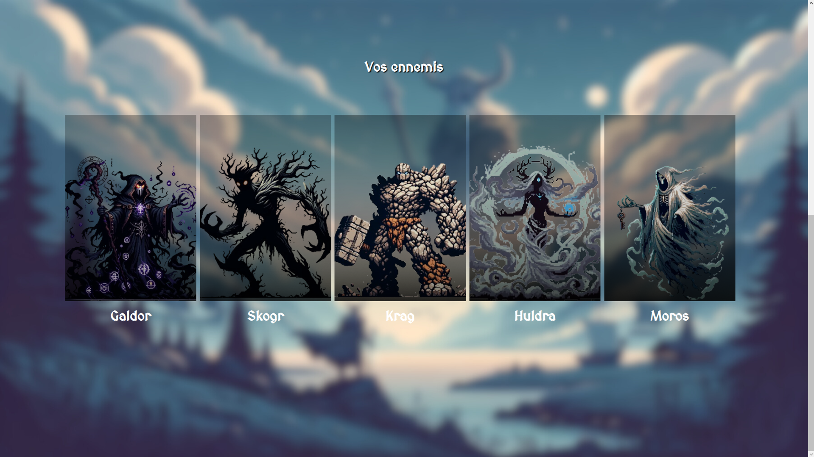
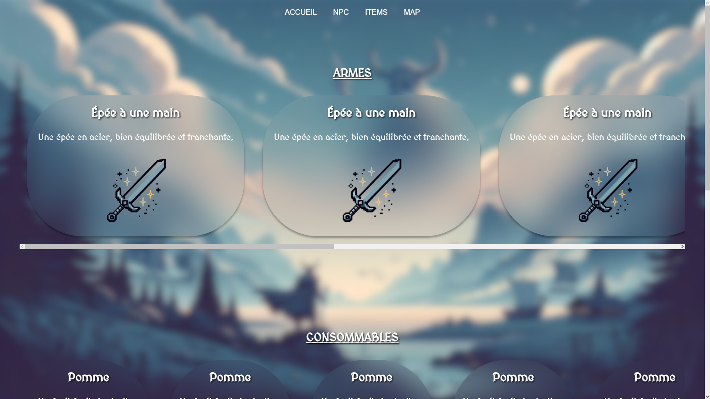
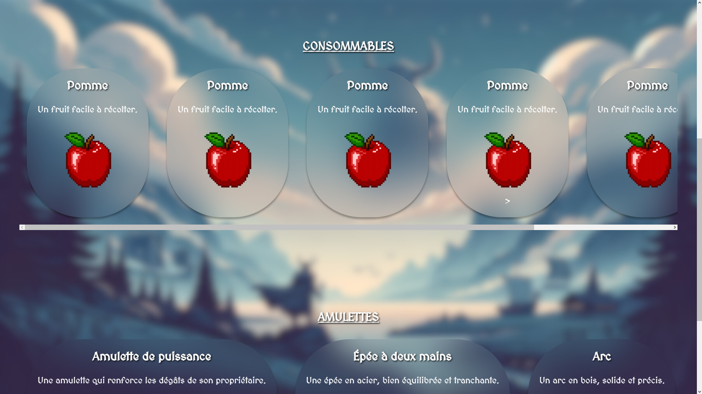
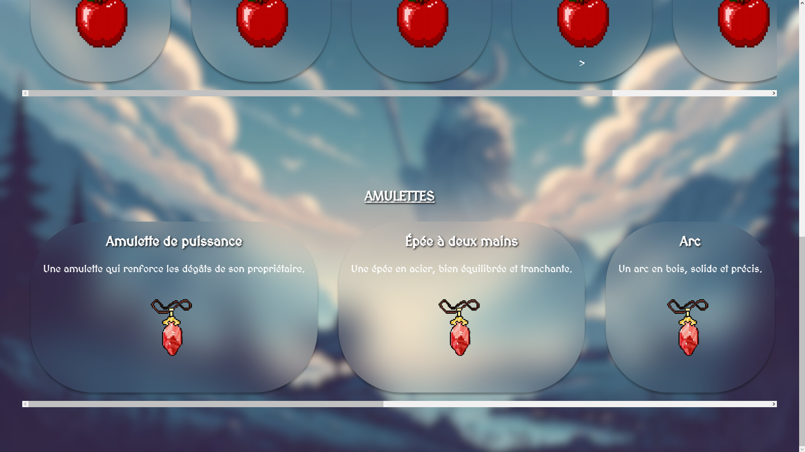
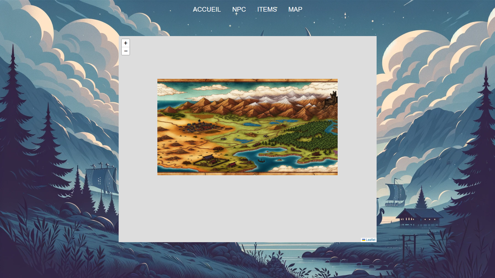

# 
Wiki RPG (langage : HTML/CSS)

## 
At the end of the year, we have to make an entire RPG game in 2D, and with all the ambitions we have about the story and the characters, we decided to create a website to help new players to understand and discover easily each aspect of our game. In this folder, you will find the website we created in a week, and it's not the definitive style, we're still thinking about what we can add/change to improve it.

# 
ACCUEIL

## 
 The "Accueil" page is the entrance of the website, with a bit of the lore of our future game.

# 
NPC

## 
 The "NPC" page show you the characters you will meet/fight in the game.

# 
Items

## 
 In the "Items" page, you will find every object, useful or not, that you can discover on the map.

# 
Map

## 
 Finally, the "Map" page will be the place you can explore freely the map.

